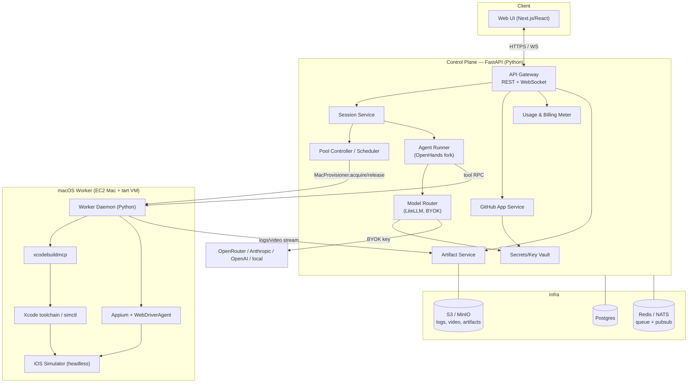
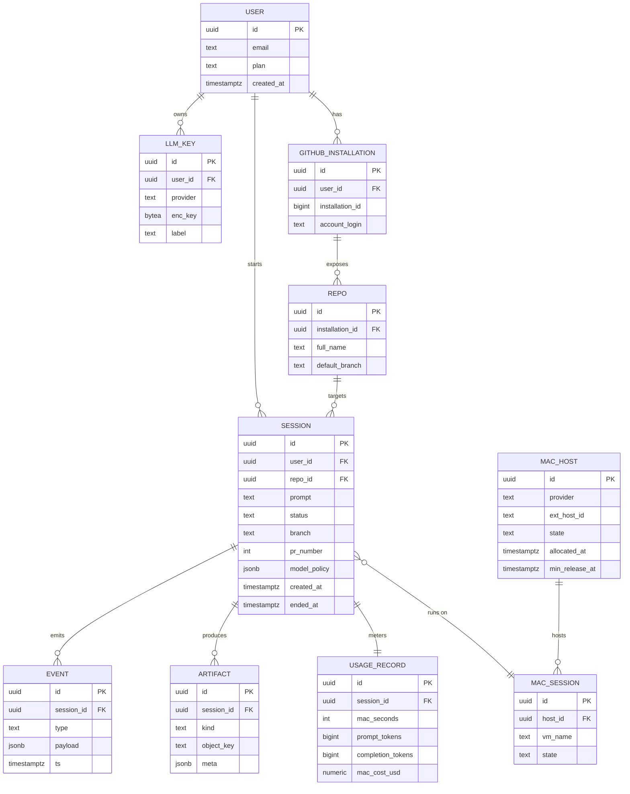
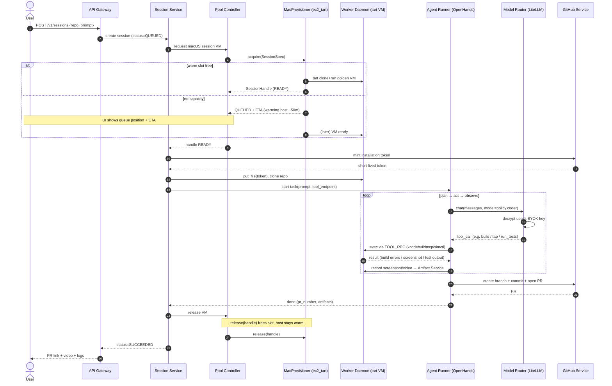
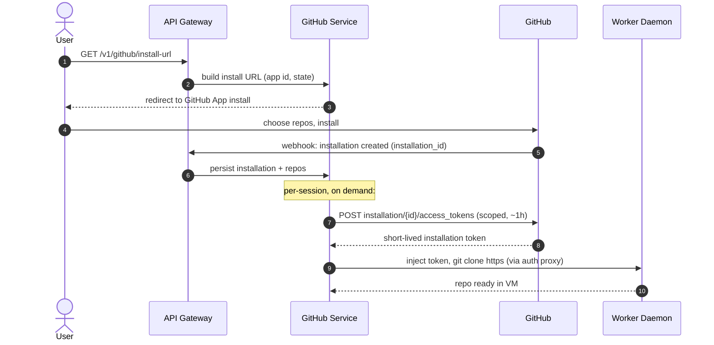
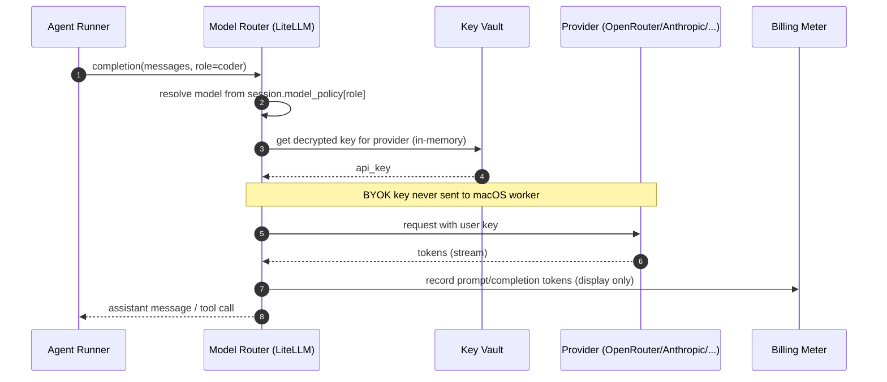
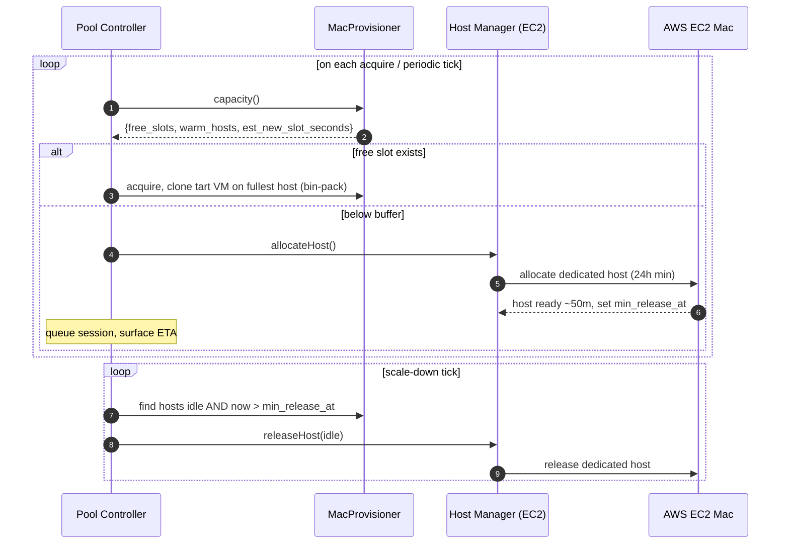
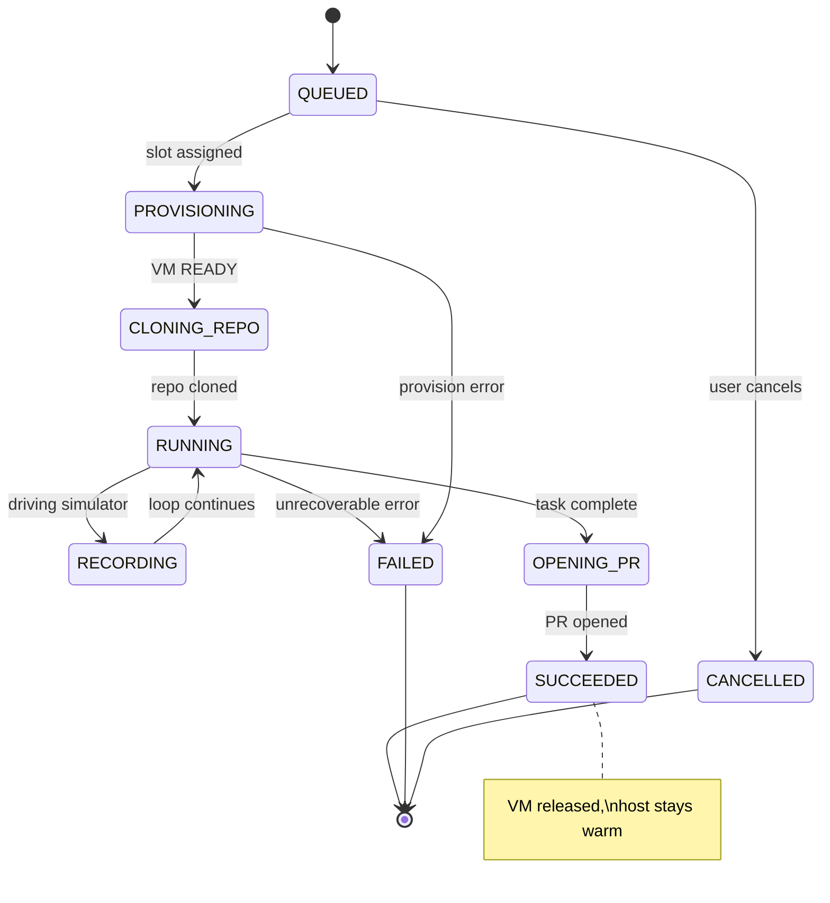

# Raven — Implementation Plan & Low-Level Design (LLD)

> Companion to `raven-plan.md` (the architecture/strategy doc). This document is the
> **buildable** view: services, data model, APIs, sequence diagrams, and a milestone plan.
>
> **Locked decisions:** Backend = **Python (FastAPI)** · Agent = **fork of OpenHands** ·
> iOS tools = **xcodebuildmcp + Appium/WDA** · Compute = **EC2 Mac + `tart`** now, **Orka**
> at Phase 2 (behind the `MacProvisioner` seam) · Model = **BYOK via LiteLLM** ·
> MVP = **Simulator-only**, self-hostable OSS.
>
> Diagrams are Mermaid — they render on GitHub and most Markdown viewers.

---

## 1. Component / Service Design

Everything except the macOS worker is one FastAPI backend (a modular monolith for MVP;
split into services later). Async throughout (`asyncio`), Postgres for state, Redis/NATS for
queue + pub/sub, S3/MinIO for artifacts.



**Service responsibilities**

| Service | Responsibility |
|---|---|
| **API Gateway** | AuthN/Z, REST endpoints, WebSocket fan-out of session events to the UI |
| **Session Service** | Session state machine; orchestrates provisioning → agent run → teardown |
| **Pool Controller / Scheduler** | Owns `MacProvisioner`; warm-host pool, bin-packing, queueing, reconciliation |
| **Agent Runner** | Wraps the OpenHands fork; runs the plan→act→observe loop; calls Model Router + worker tool RPC |
| **Model Router** | LiteLLM wrapper; resolves per-user BYOK key + per-role model; meters tokens |
| **GitHub App Service** | Installation tokens, clone/push orchestration, PR create/update, webhooks |
| **Secrets/Key Vault** | Envelope-encrypted per-user LLM keys + GitHub tokens; decrypts in-memory only |
| **Usage & Billing Meter** | Tracks Mac session-seconds (COGS) + token usage (BYOK, display only) |
| **Artifact Service** | Ingests streamed logs/screenshots/video; stores to S3/MinIO; signs URLs for UI |
| **Worker Daemon** | In the tart VM; executes tool RPCs, runs xcodebuildmcp/simctl/Appium, streams artifacts |

---

## 2. Repo / Module Layout

```
raven/
├── apps/
│   ├── web/                    # Next.js UI (TypeScript)
│   └── worker/                 # Python worker daemon (ships inside tart golden image)
│       ├── daemon.py           # gRPC/WS server: exec, channels, artifact stream
│       ├── ios_tools.py        # thin adapters over xcodebuildmcp / simctl / appium
│       └── recorder.py         # simctl recordVideo → chunked upload
├── services/                   # FastAPI backend (modular monolith)
│   ├── api/                    # routers (REST) + ws/ (WebSocket hubs)
│   ├── sessions/               # session state machine + orchestration
│   ├── scheduler/
│   │   ├── pool_controller.py
│   │   └── provisioner/
│   │       ├── base.py         # MacProvisioner ABC (the seam)
│   │       ├── ec2_tart.py     # Driver A (now)
│   │       ├── orka.py         # Driver B (Phase 2)
│   │       └── local.py        # Driver C (dev/self-host)
│   ├── agent/                  # OpenHands fork integration + iOS toolset registration
│   ├── models/                 # LiteLLM router, per-role policy, token metering
│   ├── github/                 # GitHub App client, PR ops, webhooks
│   ├── vault/                  # envelope encryption (KMS / Vault backends)
│   ├── billing/                # usage metering
│   ├── artifacts/              # ingest + object storage + signed URLs
│   └── db/                     # SQLAlchemy models, Alembic migrations
├── packimages/
│   ├── packer/                 # EC2 Mac AMI build (Packer)
│   └── tart/                   # nested golden VM build scripts
├── deploy/                     # IaC (Terraform), docker-compose (self-host), helm
└── docs/                       # raven-plan.md, this LLD, ADRs
```

---

## 3. Data Model (Postgres)



- **`enc_key`** = envelope-encrypted (KMS/Vault data key); plaintext never at rest.
- **`MAC_HOST.min_release_at`** = `allocated_at + 24h` → the pool controller must never release before this.
- **`EVENT`** is the append-only session timeline (agent thoughts, tool calls, build results) → replayed to the UI and for audit.
- **`model_policy`** on a session pins which model each role (planner/coder/summarizer) uses.

---

## 4. API Surface (selected)

**REST (FastAPI)**

| Method | Path | Purpose |
|---|---|---|
| `POST` | `/v1/keys` | store a BYOK LLM key (encrypted) |
| `GET` | `/v1/github/install-url` | begin GitHub App install |
| `GET` | `/v1/repos` | list connected repos |
| `POST` | `/v1/sessions` | create a session `{repo_id, prompt, model_policy}` |
| `GET` | `/v1/sessions/{id}` | session detail + status |
| `POST` | `/v1/sessions/{id}/cancel` | stop + teardown |
| `GET` | `/v1/sessions/{id}/artifacts` | list artifacts (signed URLs: video, screenshots, logs) |
| `GET` | `/v1/sessions/{id}/usage` | mac-seconds + token usage |
| `POST` | `/v1/webhooks/github` | GitHub App webhooks |

**WebSocket**

| Path | Purpose |
|---|---|
| `/ws/sessions/{id}` | live event stream: agent messages, tool calls, build output, screenshot thumbnails, video-ready, status transitions |

---

## 5. Sequence Diagrams (key flows)

### 5.1 Session creation → provisioning → agent loop → PR



### 5.2 GitHub App connect + authenticated clone



### 5.3 BYOK model call (LiteLLM)



### 5.4 Pool controller — scale-up / packing / release



### 5.5 Session state machine



---

## 6. Cross-cutting Concerns

- **Isolation/security:** BYOK keys decrypted only in Model Router memory, **never** sent to
  the macOS worker (LLM calls originate control-plane side). GitHub token injected into the VM
  is short-lived and the VM is destroyed post-session. Egress allowlist on workers.
- **Resilience:** `EVENT` log is the source of truth for UI replay; `MacProvisioner.reconcile()`
  rebuilds in-flight session/host state after a control-plane restart. Sessions have hard TTL +
  idle reaping.
- **Observability:** structured logs + traces per session id; host-pool metrics (utilization,
  queue depth, warm time) drive scaling and pricing.
- **Testing the harness:** `LocalMacProvisioner` + a sample iOS repo enable end-to-end CI on a
  single Mac without cloud.

---

## 7. Implementation Milestones

| # | Milestone | Deliverable | Maps to |
|---|---|---|---|
| **M0** | Apply for AWS Activate credits | $1K now; Portfolio in progress | Phase 0 |
| **M1** | Phase-0 spike script | On one EC2 Mac: clone→build→boot sim→install→launch→screenshot→recordVideo (no agent) | Phase 0 |
| **M2** | Golden images | Packer AMI + tart golden VM (Xcode, sim runtimes, xcodebuildmcp, Appium/WDA, worker daemon) | Phase 0/1 |
| **M3** | Worker daemon + `Ec2TartProvisioner` | `acquire/release/exec/channels` working against a real VM | Phase 1 |
| **M4** | Agent Runner (OpenHands fork) + iOS tools | Agent completes a scoped iOS task using xcodebuildmcp via TOOL_RPC | Phase 1 |
| **M5** | Model Router (BYOK via LiteLLM) | OpenRouter first; per-role policy; token metering | Phase 1 |
| **M6** | GitHub App + PR flow | Connect repo, clone via token, open PR with video artifact | Phase 1 |
| **M7** | Web UI (session view) | Submit task; live event/log/screenshot stream; final video + PR link | Phase 1 |
| **M8** | Pool Controller | Warm-host pool, bin-packing, queue+ETA, 24h-min-aware release, reconcile | Phase 2 |
| **M9** | Vault + multi-tenant hardening | Envelope encryption, egress controls, per-session ephemeral VM reset | Phase 2 |
| **M10** | `OrkaProvisioner` | Swap/scale to Orka fleet behind the same interface | Phase 2 |
| **M11** | Billing + tiers | Mac session-time metering → pricing tiers | Phase 2/3 |
| **M12** | iOS depth | XCUITest generation, device/signing (opt-in), multi-device matrix; Android reuse | Phase 3 |

**Critical path for a demo:** M1 → M2 → M3 → M4 → M6 → M7 (single warm Mac, single tenant).
Pool/Orka/billing (M8–M11) come after the loop is proven end-to-end.
